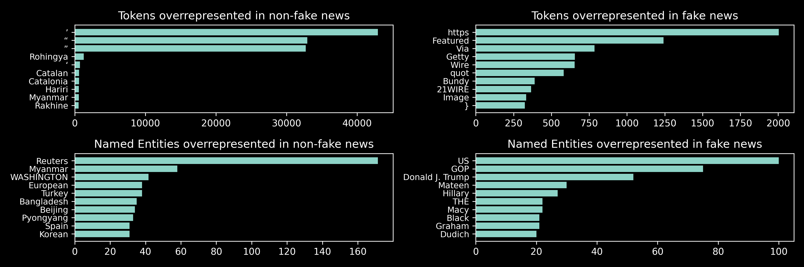

# AML2024-Project
### Project Introduction
This repository has been developed by:

- Martin Kirkegaard (marki@itu.dk)
- Florian Micliuc (flmi@itu.dk)
- Markus Sibbesen (mksi@itu.dk)

The project's scope is to classify fake news using a fine-tuned ML model. The data comes from [GonzaloA/fake_news](https://huggingface.co/datasets/GonzaloA/fake_news) and it is comprised of multiple Kaggle data sets. As we identified, **95%** of the training set comes from [ISOT Fake News Dataset](https://www.kaggle.com/datasets/emineyetm/fake-news-detection-datasets). This is how the dataset has been constructed:

*The dataset contains two types of articles fake and real News. This dataset was collected from realworld sources; the truthful articles were obtained by crawling articles from Reuters.com (News website). As for the fake news articles, they were collected from different sources. The fake news articles were collected from unreliable websites that were flagged by Politifact (a fact-checking organization in the USA) and Wikipedia. The dataset contains different types of articles on different topics, however, the majority of articles focus on political and World news topics.*

We have chosen to fine-tune the [google-bert/bert-base-uncased](https://huggingface.co/google-bert/bert-base-uncased) for the fake news classification task. This model was fine-tuned using the [GonzaloA/fake_news](https://huggingface.co/datasets/GonzaloA/fake_news) training data. Given the lack of computational resources, only 100 random sentences have been selected from the training set for the fine-tuning, and another 100 from the validation set to evaluate the model while training. The resulting model was then uploaded to HuggingFace and made public and can be found here: [FlorianMi/bert-base-uncased-fake-news-classification](https://huggingface.co/FlorianMi/bert-base-uncased-fake-news-classification)

### How to run our project?
1. Create a venv and install the following requirements:

     `pip install -r requirements.txt`

2. Open the main.ipynb and run all.  
2.1. The training cells are commented out as it is not necessary to train the model. The script will pull our fine-tuned model from Huggingface.

### Results
After fine-tuning, our model was able to predict fake news articles with a **92%** accuracy on the test set. These results, which seem too good to be true, given the small amount of training data we used, raise the following questions:
 - How is our model predicting fake news?  
When inspecting our model's attention, we have discovered that *content does not matter*. Given that our true news data comes from Reuters, then the structure and the tone of the non-fake articles can be very similar. Below you can see the model's attention for an article that is True and correctly labelled and an article that is Fake and is correctly labelled.

As you can see in the picture above, the model's focus is mostly on the punctuation marks and the tone.

For the True article, the model focus shifts on content and the most important token is *said* as seen above. 

 - Why is the model able to do that?  
The model is able to identify True News and Fake News because of the article structure, tone and punctuation. Given that all of our training data comes exclusively from Reuters, then our model is only able to identify those as True News articles.

In other words, our Fake News classifier is merely only a *is this a Reuters article?* classifier. Another problem is how the Fake News articles have been classified as Fake. Articles were not fact-checked seperately, but only were flagged as Fake if they came from a news website which is not trust-worthy. In other words, the articles can be completely truthful, but if they came from an untrusted source, then the article is labelled as Fake.