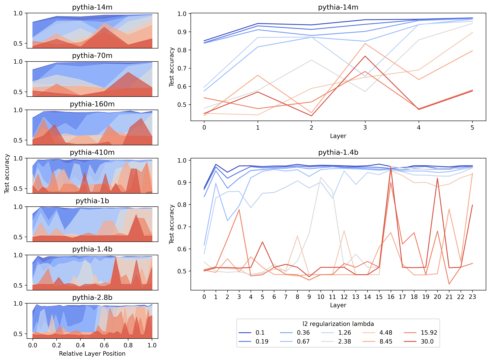
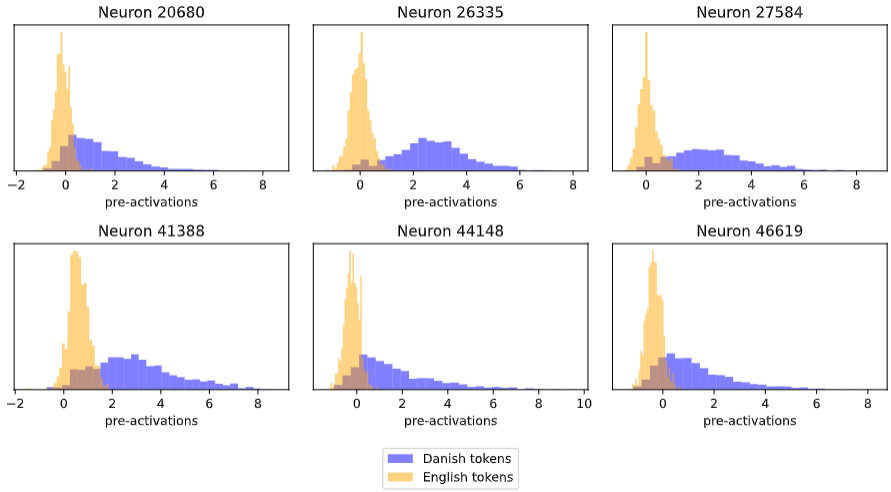
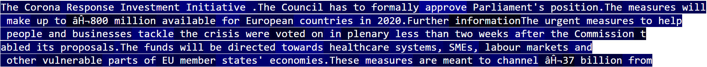

# Identifying Danish Context Neurons in the Pythia Models

This is a project we (Markus Sibbesen and Martin Kirkegaard) did as a part of our mandatory Research Project course, intended as a self-directed project (with help from a supervisor), which serves as preparation for the Master's Thesis.

---

## Summary of Findings

In this project, we fit an SAE on a different size models from the Pythia suit and use it to identify neurons representing the feature of Danish language text. First, we use *Classification probes* to investigate a range of different size language models, to find which model (and which layer) would be a good candidate for identifying Danish language features. We find layer 16 of the 1.4 billion parameter model to be a suitable choice, fit an SAE on the multi layer perceptron activations and use it to identify 6 neurons overrepresented in Danish text.

We measure the performance of the model both on next token prediction and a range of downstream tasks in both English and Danish and find that artificially lowering the activation of the Danish language neurons impacts the performance on Danish tasks considerably more than English.


### Methods

#### Classification Probes

For each layer on each model, we train a probe $\sigma_\beta(\textbf{x})$ on the internal activation vector $\textbf{x}\in \mathbb{R}^n$. The probe is defined as:

```math
\sigma_\beta(\textbf{x}) = \frac{1}{1 + e^{-(\beta_0 + \beta_1 x_1 + \dots + \beta_n x_n)}}
```
where $\beta_0$ is a bias, $\beta_ix_i$ is the probe's weight and the corresponding neuron activation from the original model. The probe is then trained by minimizing the expected binary cross-entropy loss

```math
\mathcal{L} = y \cdot\log(\sigma_\beta(\textbf{x})) + (1-y)\cdot\log(1 -\sigma_\beta(\textbf{x}))
```
where $y \in \{0, 1\}$ is the ground truth for the language ($0=Danish, 1=English$)

We limit the flexibility of our probes by adding an L2 regularisation term to the loss function:

```math
L_2 = \lambda \cdot \sqrt{ \sum_{i=0}^n \beta_i^2}
```
where $\lambda$ is hyperparameter that sets the strength of the regularization.


#### Sparse Autoencoders

Our Sparse Autoencoder (SAE) consists of an encoding weight matrix $W_e \in \mathbb{R}^{m \times n}$, a decoding weight matrix $W_d \in \mathbb{R}^{n \times m}$ and an encoding bias $\textbf{b}_e \in \mathbb{R}^m$. Additionally, we use a pre-encoder bias $\textbf{b}_p \in \mathbb{R}^n$, which we subtract before encoding and then re-add after decoding. 

We ensure sparsity in the hidden layer directly, by using a $topk$ activation function, which restricts the latent representation to only the $k$ highest activations, setting the rest to zero. 


The SAE is then trained by minimizing the expected mean square error (MSE) reconstruction loss 
```math
\mathcal{L} =  \lVert\textbf{x} - \hat{\textbf{x}}\rVert_2^2,\quad
\hat{\textbf{x}} = W_d\mathrm{topk}(W_e(\textbf{x} - \textbf{b}_p) + \textbf{b}_e) + \textbf{b}_p
```

We train an SAE on layer 16 of pythia-1.4b, 'with an expansion factor of 8, meaning we have 8192 input neurons and 65536 hidden neurons. We set $k=32$. We train on the NeuLab-TedTalks datasets using an A100 on Google Colab.


### Results

#### Classification Probes



*Accuracy for our classification probes on the different sized Pythia models*

We find that with low regularization factors, the probes achieve high accuracy on all layers, but as we increase the $\lambda$-value, it drops starkly in the early layers, but stays high for longer in the later layers. On the larger models, we observe a notable "phase transition" somewhere between the middle layer and three fourths into the model.

Qualitatively, the most noticeable single layer rise occurs on layer 16 of pythia-1.4b, which achieves upwards of $90\%$ accuracy even with high regularization factors, notably higher than the layers immediately before *and* after. We therefore chose to focus on training our SAE on the activations from this layer.

#### Sparse Autoencoder



*Pre-activation levels of 6 SAE latent neurons which have higher activation levels in Danish than Dnglish*

On the test set of NeuLab-TedTalks, we identify 6 neurons, which are active on more than 50\% of tokens in the Danish sentences, but less than 1\% of tokens in the English sentences.

We plot their pre-activations (their values before the topK activation function) and observe that for all of them, their pre-activations are (expectedly) significantly higher on Danish tokens than English. In particular, neuron 26335 shows remarkably little overlap between the two languages.


*Preactivation of neuron 26335 on a sample of Danish text*



*Preactivation of neuron 26335 on a sample of English text*

We wanted to illustrate how the neuron behaved on sample Danish and English text, so we computed its pre-activation on a sample of Danish and English parallel text.


*Results for next token prediction as we vary the activation of Danish latents*

To test the effect of the Danish neurons on the model, we measure the model's performance as we vary their activations. This is done by inserting our trained SAE on layer 16 of the model, replacing the output with our reconstruction. Now we can manually set the values of particular SAE latents and observe the effect on the model output.

We measure the cross-entropy loss for next token prediction on the Danish and English parts of the parallel ELRC\_2923 dataset, respectively, as we fix the activation of the 6 neurons at different levels. We find that lowering the value has an outsized negative influence on performance on Danish text in particular, compared with English text, suggesting that the neurons are causally relevant for Danish performance.


